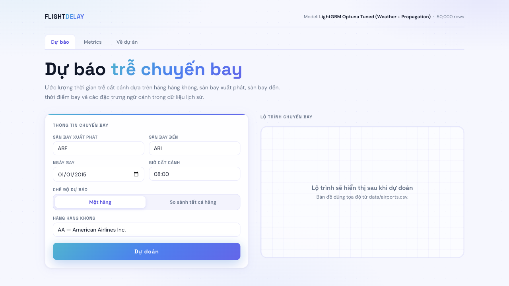

# Flight Delay Predictor — Data Mining Final Project

Hệ thống dự đoán thời gian trễ cất cánh của chuyến bay nội địa Mỹ, triển khai đầy đủ pipeline Data Mining từ EDA đến demo web tương tác.

Final project — Data Mining course, 2026.

---

## Mục lục

- [Giới thiệu](#giới-thiệu)
- [Dataset](#dataset)
- [Giao diện demo](#giao-diện-demo)
- [Cấu trúc dự án](#cấu-trúc-dự-án)
- [Pipeline](#pipeline)
- [Kết quả](#kết-quả)
- [Cài đặt & Chạy demo](#cài-đặt--chạy-demo)
- [Tech Stack](#tech-stack)

---

## Giới thiệu

Project xây dựng một pipeline **Data Mining hoàn chỉnh** trên tập dữ liệu US DOT 2015 — bao gồm 14 hãng hàng không nội địa Mỹ. Do giới hạn RAM của Google Colab free, notebook sử dụng **tháng 1/2015** (~450.000 chuyến bay) làm tập dữ liệu huấn luyện. Mục tiêu là dự đoán **thời gian trễ cất cánh (phút)** dựa trên thông tin chuyến bay, đặc trưng thời gian, thời tiết và lịch sử delay.

Demo cuối được đóng gói thành **Flask web app** cho phép dự báo delay theo từng hãng hoặc so sánh toàn bộ hãng trên cùng một route, kèm bản đồ lộ trình tương tác.

---

## Dataset

| Thuộc tính | Chi tiết |
|-----------|---------|
| **Nguồn** | [US DOT 2015 Flight Delays & Cancellations](https://www.kaggle.com/datasets/usdot/flight-delays) |
| **Kích thước** | ~5.8 triệu chuyến bay (gốc); notebook dùng ~450.000 chuyến — tháng 1/2015 |
| **Phạm vi** | Chuyến bay nội địa Mỹ, tháng 1/2015 (subset từ dataset gốc cả năm 2015) |
| **Hãng hàng không** | 14 hãng (AA, AS, B6, DL, EV, F9, HA, MQ, NK, OO, UA, US, VX, WN) |
| **Target** | `DEPARTURE_DELAY` — độ trễ cất cánh tính bằng phút |
| **Files chính** | `flights.csv`, `airlines.csv`, `airports.csv` |

> **Lưu ý:** Do kích thước lớn, `flights.csv` không được đưa vào repo. Tải về từ Kaggle và đặt vào Google Drive trước khi chạy notebook.
>
> **Về tập dữ liệu dùng trong notebook:** Toàn bộ phân tích EDA được thực hiện trên **tháng 1/2015** (~450.000 chuyến bay). Riêng giai đoạn modeling (Section 6.4 trở đi) dùng random sample **50.000 dòng** từ tập tháng 1 (tham số `MAX_MODEL_ROWS = 50_000`) để tối ưu tốc độ huấn luyện trên Colab free tier. Dataset gốc đầy đủ chứa ~5.8 triệu chuyến bay suốt cả năm 2015.

---

## Giao diện demo



Giao diện Flask demo gồm form nhập sân bay đi/đến, ngày giờ bay, chế độ dự báo theo một hãng hoặc so sánh tất cả hãng, cùng vùng bản đồ lộ trình sẽ hiển thị sau khi dự đoán.

---

## Cấu trúc dự án

```
.
├── assets/
│   └── screenshots/
│       └── predictor-home.png               # Ảnh giao diện demo
├── CK_DataMining_all_airlines_final.ipynb   # Notebook chính (train trên Colab)
├── app.py                                   # Flask backend
├── requirements.txt                         # Dependencies cho Flask app
├── models/
│   └── flight_delay_all_airlines_model.pkl  # Model artifact (sau khi train)
├── templates/
│   └── index.html                           # Giao diện web
├── static/
│   ├── css/style.css
│   └── js/app.js
└── data/
    └── airports.csv                         # Tọa độ sân bay (dùng cho bản đồ)
```

---

## Pipeline

### Phần 0–5 · Exploratory Data Analysis

- Tổng quan dataset: phân phối delay, tỷ lệ chuyến đúng giờ/trễ nhẹ/trễ nặng theo từng hãng
- Mô hình hóa phân phối delay bằng hàm mũ — trích xuất hệ số đặc trưng cho từng hãng (Hawaiian Airlines thấp nhất, Spirit Airlines cao nhất)
- Phân tích ảnh hưởng của **sân bay xuất phát** và **route** đến delay (heatmap, error bar)
- **Temporal variability:** delay tăng dần theo giờ trong ngày (chuyến tối tích lũy delay từ các chuyến trước), fit bậc 2 để xác nhận trend

### Phần 6 · Modeling

| Section | Mô hình | Đặc trưng |
|---------|---------|-----------|
| 6.1 | Polynomial Regression | 1 hãng, 1 sân bay, giờ bay |
| 6.2 | Linear / Polynomial / Ridge | Toàn bộ hãng + sân bay xuất phát |
| 6.3 | Ridge Polynomial | Thêm sân bay đến (route modeling) |
| 6.4 | **ML Benchmark** (11 thuật toán) | Time features + AIRLINE + Origin + Destination |
| 6.5 | TabNet + Tabular Transformer | Deep Learning cho tabular data |
| 6.6 | Error Analysis | Residuals, bias theo sân bay/giờ/route, trade-off RMSE vs training time |

**ML Benchmark (6.4)** so sánh: Dummy Baseline, Linear Regression, Ridge, Lasso, ElasticNet, KNN, Decision Tree, Random Forest, Extra Trees, HistGradientBoosting, XGBoost, LightGBM — với cross-validation 3-fold.

### Phần 7 · Extended Development

| Section | Nội dung | Kết quả |
|---------|---------|---------|
| 7.1 | Weather features (meteostat) | RMSE giảm 3.3% |
| 7.2 | Delay Propagation features | RMSE giảm tiếp 0.9% |
| 7.3 | Classification task (trễ ≥ 15 phút) | ROC-AUC 0.7341 |
| 7.4 | Hyperparameter tuning (Optuna, 50 trials) | RMSE tốt nhất 12.910 phút |
| 7.5 | Fairness Analysis theo sân bay và vùng địa lý | Phát hiện bias Mountain region |

---

## Kết quả

### Leaderboard (Test set)

| Giai đoạn | RMSE (phút) | MAE (phút) | R² |
|-----------|------------|------------|-----|
| Dummy Baseline | 14.215 | 10.316 | ~0 |
| Linear / Ridge | ~13.7 | ~9.8 | ~0.07 |
| **LightGBM (6.4)** | 13.505 | 9.521 | 0.0975 |
| + Weather (7.1) | 13.052 | 9.065 | 0.1569 |
| + Propagation (7.2) | 12.941 | — | — |
| **+ Optuna (7.4) — Deploy** | **12.910** | **8.999** | **0.1587** |

**Model được deploy:** LightGBM với Optuna tuning, weather features và delay propagation, đóng gói trong sklearn Pipeline — serialize bằng `joblib`, load trực tiếp trong Flask mà không cần tái tạo preprocessing.

> R² ~0.16 là mức hợp lý cho bài toán này — flight delay phụ thuộc nhiều yếu tố vận hành thời điểm thực (sự cố kỹ thuật, ATC slot, gate conflict) vốn không có trong dataset lịch sử.

---

## Cài đặt & Chạy demo

### Yêu cầu

- Python 3.9+
- File `flight_delay_all_airlines_model.pkl` (train xong từ notebook, đặt vào `models/`)
- File `airports.csv` (đặt vào `data/`)

### Bước 1 — Train model trên Colab

```
1. Upload flights.csv, airlines.csv, airports.csv lên Google Drive
2. Mở CK_DataMining_all_airlines_final.ipynb trên Google Colab
3. Mount Drive và chạy lần lượt các cell
4. Cell cuối sẽ lưu flight_delay_all_airlines_model.pkl lên Drive
5. Tải file .pkl về máy, đặt vào thư mục models/
```

Cấu hình chạy nhanh (tiết kiệm RAM Colab free):

```python
RUN_DEEP_LEARNING = False   # Bỏ qua TabNet / Tabular Transformer
RUN_WEATHER       = True    # Giữ để có weather features
RUN_OPTUNA        = True    # Giữ để có hyperparameter tuning
```

### Bước 2 — Chạy Flask app

```bash
# Tạo virtual environment
python -m venv venv
source venv/bin/activate        # macOS/Linux
venv\Scripts\activate           # Windows

# Cài dependencies
pip install -r requirements.txt

# Chạy server
python app.py
```

Mở trình duyệt tại **http://127.0.0.1:5000**

### Tính năng demo

- **Dự báo một hãng** — chọn hãng, sân bay đi/đến, ngày, giờ → nhận delay dự đoán + bản đồ route
- **So sánh tất cả hãng** — bảng xếp hạng 14 hãng trên cùng route, highlight hãng ít trễ nhất
- **Tab Metrics** — RMSE, MAE, R², model leaderboard và feature importance chart
- **Lịch sử dự đoán** — lưu các lần dự báo trong session

---

## Tech Stack

| Layer | Thư viện |
|-------|---------|
| Data Processing | pandas, numpy |
| Visualization | matplotlib, seaborn, folium |
| Machine Learning | scikit-learn, XGBoost, LightGBM |
| Deep Learning | PyTorch, pytorch-tabnet |
| Hyperparameter Tuning | Optuna |
| Weather Data | meteostat |
| Model Serialization | joblib |
| Web Backend | Flask |
| Frontend | HTML/CSS/JS (vanilla), Space Grotesk + DM Sans |

---

## Hạn chế

- Dataset năm 2015 — pattern vận hành hàng không đã thay đổi sau COVID-19
- Weather features dùng daily average, không phải hourly tại giờ bay cụ thể
- Thiếu `TAIL_NUMBER` để track delay propagation theo từng máy bay
- Demo gán mặc định 0 cho weather và propagation features vì người dùng không có thông tin này

---

## License

Dự án học thuật — chỉ dùng cho mục đích nghiên cứu và học tập.
